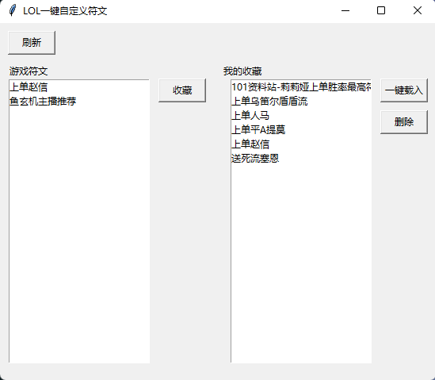

# LOL(英雄联盟)一键载入自定义天赋(符文)

WeGame等Lol辅助工具无法收藏自定义天赋，只能使用推荐的天赋。于是开发了这么一个小工具，来一键载入自定义的天赋。

> 本程序可以和WeGame同时使用

# 程序界面

# 使用方式

首先运行游戏，然后使用**管理员模式**运行gui.py文件即可打开程序。

左边为游戏中的天赋，右边为本地收藏的天赋。可以先在游戏中编辑好天赋，然后点击刷新按钮后，即可获取游戏中的天赋。在需要时对我的收藏中的天赋一键载入即可。

